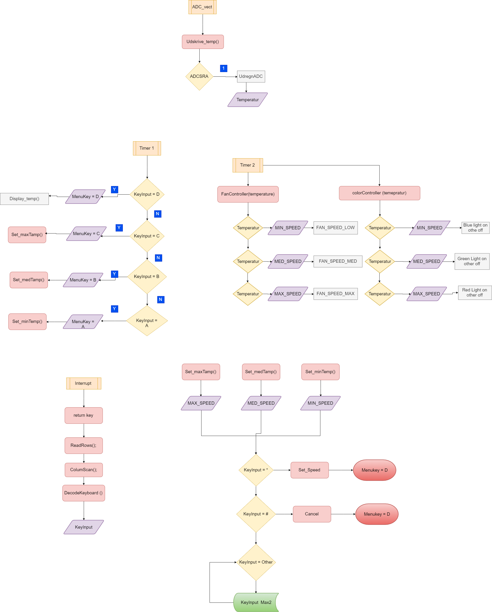

# 
Embede Project

For this project I have choose to use an LCD, Keypad, hue ,  thermometer and a fan.
 The objective of my project is to be able to measure a house temperature, and be able to display it on an LCD (change temperature) , at wish the fan will be regulate depending on the temperature on the house, the keypad will be use to change the temperature in the house.

***
# The program is on the Feature branch since the project is unfinish.
***
---
# Main Flowshart

---
___

in our main C file, where we start the program there will be 2 interrupt and 2 timer interrupt.
the Init represent all the funtion that will be Initialise under the start,
and of course our super loop

___

---
# Here are the overview of the flowshart

---
___

# The ADC flowshart

___

With the help of ADC we will be able to read our Thermometer value, because ;
The ADC converts an anlog input voltage to a 10-bit digital value. wiht the help of an ADCSR bit the interrupt will know when the translation is done before it rerun the conversion again.
everytime the conversion is down it will return/set a global variable  with the temperatur value
___

# Interrupt Flowshart

___

the interrupt are use by your keypad, the explaination of the function and an earlier verrsion will be at 
[Markdown](https://github.com/0code1/Keypadx)
The Timer1 will be depending on the interrupt function return/global variable to be able to know what the write on the lcd
___

# Our Frst timer

 
___

The first timer is running at a 1 second clock, as wish it will Write what we need on the display, as we set the MenuKey global variable to D, at the start of the program. it will start to desplay our temperature until the keypad input change the  return/global variable MenuKey
___

 
___

here we can see if our Keymenu is on the other option, we will have the possibility to change the temperature  limit
with the help of keyinput and Menukey

___

# Timer2 flowshart

___

The timer2 is running at a clockrate of 5 second and have too function the first one FanContoller(temperature)  will set the fun speed depending on the return/global variable  to set the fan speed. and the colorController(temperature) will set the color on  a HUE led in different color with the same return/global variable.
___

